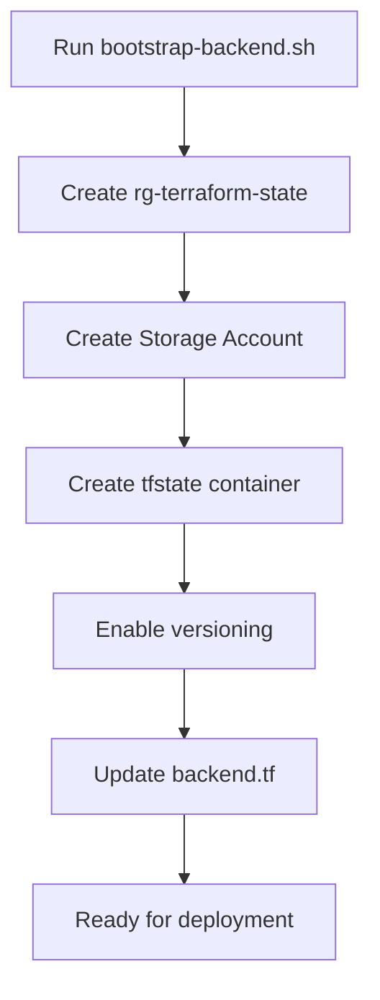
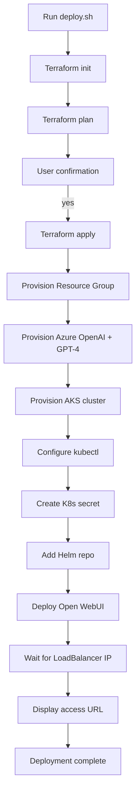
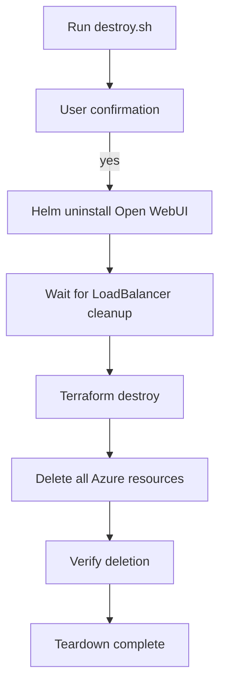

# Architecture Documentation

## Overview

This document describes the architecture, components, design decisions, and trade-offs for the Open WebUI on AKS with Azure OpenAI deployment.

## System Architecture

### High-Level Architecture

```
┌─────────────────────────────────────────────────────────────────┐
│                          End Users                              │
└────────────────────────────┬────────────────────────────────────┘
                             │ HTTP
                             ↓
┌─────────────────────────────────────────────────────────────────┐
│                   Azure Load Balancer                           │
│                   (Public IP: <external-ip>)                    │
└────────────────────────────┬────────────────────────────────────┘
                             │
                             ↓
┌─────────────────────────────────────────────────────────────────┐
│              Azure Kubernetes Service (AKS)                     │
│  ┌──────────────────────────────────────────────────────────┐  │
│  │          System Node Pool (Regular Nodes)                 │  │
│  │  - 1x Standard_B2s (2 vCPU, 4GB RAM)                     │  │
│  │  - Runs critical AKS system pods                         │  │
│  │  - Always available (not spot)                           │  │
│  └──────────────────────────────────────────────────────────┘  │
│  ┌──────────────────────────────────────────────────────────┐  │
│  │          User Node Pool (Spot Instances)                  │  │
│  │  - 1x Standard_B2s spot (90% cost savings)               │  │
│  │  - Runs Open WebUI application pod                       │  │
│  │  - Tolerations for spot scheduling                       │  │
│  │                                                            │  │
│  │  ┌────────────────────────────────────────────────────┐  │  │
│  │  │       Open WebUI Pod                                │  │  │
│  │  │  - Port: 8080                                       │  │  │
│  │  │  - Resources: 250m CPU / 512Mi RAM                  │  │  │
│  │  │  - Environment: Azure OpenAI config                 │  │  │
│  │  └────────────────────────────────────────────────────┘  │  │
│  └──────────────────────────────────────────────────────────┘  │
│                                                                  │
│  Networking: Kubenet (10.244.0.0/16 pod CIDR)                  │
│  CNI: Kubenet (cheaper than Azure CNI)                         │
└────────────────────────────┬────────────────────────────────────┘
                             │ HTTPS API Calls
                             ↓
┌─────────────────────────────────────────────────────────────────┐
│              Azure OpenAI Service (AI Foundry)                  │
│  ┌──────────────────────────────────────────────────────────┐  │
│  │  GPT-4 Model Deployment                                   │  │
│  │  - Model: gpt-4 (version 0613)                           │  │
│  │  - Capacity: 10K TPM (cost control)                      │  │
│  │  - API Version: 2024-02-15-preview                       │  │
│  │  - Authentication: API Key                               │  │
│  └──────────────────────────────────────────────────────────┘  │
│                                                                  │
│  Endpoint: https://<unique-name>.openai.azure.com              │
│  Location: East US                                              │
└─────────────────────────────────────────────────────────────────┘
```

### Component Diagram

```
┌─────────────────────────────────────────────────────────────────┐
│                     Resource Group                              │
│                  (rg-uniqueai-poc-demo)                         │
│                                                                  │
│  ┌────────────────────────────────────────────────────────┐    │
│  │  Azure Cognitive Services (OpenAI)                      │    │
│  │  - Kind: OpenAI                                         │    │
│  │  - SKU: S0 (Standard)                                   │    │
│  │  - Public network access enabled (POC)                  │    │
│  └────────────────────────────────────────────────────────┘    │
│                                                                  │
│  ┌────────────────────────────────────────────────────────┐    │
│  │  AKS Cluster                                            │    │
│  │  - SKU Tier: Free                                       │    │
│  │  - Kubernetes: 1.28.9                                   │    │
│  │  - Network Plugin: Kubenet                              │    │
│  │  - Identity: System-Assigned Managed Identity           │    │
│  └────────────────────────────────────────────────────────┘    │
│                                                                  │
│  ┌────────────────────────────────────────────────────────┐    │
│  │  Node Resource Group (Auto-created)                     │    │
│  │  - VMs for cluster nodes                                │    │
│  │  - Load Balancer                                        │    │
│  │  - Network Security Groups                              │    │
│  │  - Virtual Network                                      │    │
│  └────────────────────────────────────────────────────────┘    │
└─────────────────────────────────────────────────────────────────┘

┌─────────────────────────────────────────────────────────────────┐
│              Terraform State Backend (Separate RG)              │
│  - Resource Group: rg-terraform-state                           │
│  - Storage Account: tfstate<unique-id>                          │
│  - Container: tfstate                                           │
│  - Versioning: Enabled                                          │
└─────────────────────────────────────────────────────────────────┘
```

## Components

### 1. Azure OpenAI Service (Azure AI Foundry)

**Purpose:** Provides GPT-4 language model via OpenAI-compatible API

**Configuration:**
- **Resource Type:** `azurerm_cognitive_account`
- **Kind:** OpenAI
- **SKU:** S0 (Standard)
- **Location:** East US
- **Model:** GPT-4 (version 0613)
- **Capacity:** 10K tokens per minute (TPM)
- **API Version:** 2024-02-15-preview
- **Authentication:** API Key (stored in Kubernetes secret)

**Why GPT-4:**
- Higher quality responses for demonstration
- Better reasoning and context understanding
- Professional presentation impact
- Cost controlled via 10K TPM limit

**Trade-offs:**
- More expensive than GPT-3.5-Turbo (~10x per token)
- But: Controlled capacity limits maximum spend
- Demo usage expected to be minimal ($5-10 total)

### 2. Azure Kubernetes Service (AKS)

**Purpose:** Container orchestration platform for Open WebUI

**Cluster Configuration:**
- **SKU Tier:** Free (no control plane cost)
- **Kubernetes Version:** 1.28.9
- **Network Plugin:** Kubenet
- **Load Balancer SKU:** Standard
- **Network Policy:** Calico
- **Identity:** System-Assigned Managed Identity

**Node Pools:**

#### System Node Pool (Default)
- **Mode:** System
- **Count:** 1 node (fixed, no auto-scaling)
- **VM Size:** Standard_B2s (2 vCPU, 4GB RAM)
- **Priority:** Regular (not spot)
- **Purpose:** Runs critical Kubernetes system components
- **Cost:** ~$30-35/month

**Why regular nodes for system pool:**
- System pods require high availability
- Spot eviction would impact cluster stability
- Cost is reasonable for guaranteed uptime

#### User Node Pool
- **Mode:** User
- **Count:** 1 node (fixed, no auto-scaling)
- **VM Size:** Standard_B2s (2 vCPU, 4GB RAM)
- **Priority:** Spot (90% cost savings)
- **Eviction Policy:** Delete
- **Spot Max Price:** -1 (current on-demand price)
- **Node Labels:** `workload-type=spot`
- **Node Taints:** `kubernetes.azure.com/scalesetpriority=spot:NoSchedule`
- **Purpose:** Runs Open WebUI application workload
- **Cost:** ~$3-5/month

**Why spot instances for user workload:**
- 90% cost savings compared to regular instances
- Open WebUI is stateless (no data loss on eviction)
- Demo can tolerate brief interruptions
- System remains stable even if spot node evicted

**Trade-offs:**
- Mixed approach balances cost vs. reliability
- Alternative considered: All spot nodes (higher risk)
- Alternative considered: All regular nodes (higher cost ~$60-70/month)

### 3. Open WebUI

**Purpose:** Modern chat interface for interacting with GPT-4

**Deployment:**
- **Method:** Helm chart (official Open WebUI chart)
- **Repository:** https://helm.openwebui.com/
- **Replicas:** 1 (stateless)
- **Container:** ghcr.io/open-webui/open-webui:latest
- **Port:** 8080 (internal), 80 (LoadBalancer)

**Resource Allocation:**
- **Requests:** 250m CPU, 512Mi memory
- **Limits:** 1000m CPU, 1Gi memory

**Scheduling:**
- **Tolerations:** Spot instance toleration
- **Node Selector:** `workload-type=spot`
- **Result:** Pod always schedules on spot node pool

**Persistence:**
- **Enabled:** No (stateless deployment)
- **Rationale:** Reduces cost, simplifies POC
- **Trade-off:** User data not persisted across restarts

### 4. Networking

**Network Plugin: Kubenet**
- **Pod CIDR:** 10.244.0.0/16
- **Service CIDR:** 10.0.0.0/16
- **DNS Service IP:** 10.0.0.10

**Why Kubenet:**
- Lower cost than Azure CNI
- Sufficient for POC requirements
- Azure CNI alternative: More expensive, advanced features not needed

**Load Balancer:**
- **Type:** Azure Standard Load Balancer
- **Public IP:** Auto-assigned
- **Purpose:** Exposes Open WebUI to internet

**Security:**
- Public access enabled for POC demonstration
- Production would use: Private cluster, Private Link, Ingress controller with TLS

## Design Decisions

### Cost Optimization Strategies

| Strategy | Impact | Reasoning |
|----------|--------|-----------|
| Free tier AKS | $0 control plane | Removes fixed ~$72/month cost |
| Spot instances (user pool) | 90% savings (~$27/month) | Workload tolerates brief interruptions |
| Standard_B2s VMs | Small, cost-effective | Adequate for POC, burstable performance |
| Kubenet networking | Lower cost vs CNI | Simpler networking, sufficient for POC |
| No persistence | Saves storage costs | Stateless demo doesn't require data retention |
| 10K TPM capacity | Limits token usage | Prevents runaway costs during demo |
| Single region | No multi-region cost | East US provides all required services |

**Total Infrastructure Cost: ~$40-50/month**

### Alternative Architectures Considered

#### Option 1: All Regular Nodes
- **Cost:** ~$60-70/month
- **Pros:** Maximum reliability, no eviction risk
- **Cons:** Higher cost, over-provisioned for POC
- **Decision:** Rejected - cost not justified for POC

#### Option 2: All Spot Nodes
- **Cost:** ~$6-10/month
- **Pros:** Minimum cost
- **Cons:** System instability, cluster can go fully offline
- **Decision:** Rejected - too risky for demo presentation

#### Option 3: Azure Container Apps
- **Cost:** Similar or lower
- **Pros:** Serverless, simpler management
- **Cons:** Case study requires AKS specifically
- **Decision:** Rejected - doesn't meet requirement

#### Option 4: GPT-3.5-Turbo
- **Cost:** 10x cheaper per token
- **Pros:** Lower token costs
- **Cons:** Lower quality responses for demo
- **Decision:** User chose GPT-4 for better demonstration quality

### Security Considerations

**Current POC Configuration:**
- Public AKS API endpoint
- Public OpenAI endpoint
- API key authentication
- No network policies
- No TLS/HTTPS

**Production Recommendations:**
1. **Private AKS cluster** - API endpoint not exposed to internet
2. **Azure Private Link** - Private connection to Azure OpenAI
3. **Managed Identity** - Replace API keys with identity-based auth
4. **Network Security Groups** - Restrict traffic flows
5. **Azure Key Vault** - Secure secret management
6. **Ingress Controller** - HTTPS/TLS termination with cert-manager
7. **Network Policies** - Pod-to-pod communication restrictions
8. **RBAC** - Role-based access control for Kubernetes
9. **Pod Security Policies** - Container security standards
10. **Azure Policy** - Compliance enforcement

**Trade-off:** Security vs. POC simplicity
- Current: Optimized for demo and cost
- Production: Would implement all recommendations above

### Scalability Considerations

**Current Limitations:**
- Fixed 2 nodes (no auto-scaling)
- Single replica Open WebUI
- 10K TPM Azure OpenAI capacity

**Production Improvements:**
1. **Horizontal Pod Autoscaler (HPA)** - Scale Open WebUI based on CPU/memory
2. **Cluster Autoscaler** - Scale node pools based on demand
3. **Azure OpenAI higher capacity** - Increase TPM as needed
4. **Multiple replicas** - High availability
5. **Persistent storage** - User data retention
6. **CDN** - Static asset delivery
7. **Redis cache** - Session management

**Trade-off:** Scalability vs. POC cost
- Current: Fixed scale, predictable cost
- Production: Dynamic scaling, variable cost

## Infrastructure as Code

### Terraform Module Structure

```
terraform/
├── main.tf              # Orchestrates all modules
├── variables.tf         # Input variables
├── outputs.tf           # Output values
├── providers.tf         # Azure provider config
├── backend.tf           # Remote state configuration
└── modules/
    ├── resource-group/  # Azure resource group
    ├── ai-foundry/      # Azure OpenAI provisioning
    └── aks/             # AKS cluster with node pools
```

**Module Design Philosophy:**
- **Reusability:** Modules can be used in other projects
- **Testability:** Each module can be tested independently
- **Maintainability:** Clear separation of concerns
- **Scalability:** Easy to add new modules

### State Management

**Backend: Azure Storage**
- **Resource Group:** rg-terraform-state (separate from POC resources)
- **Storage Account:** tfstate<unique-id>
- **Container:** tfstate
- **State File:** uniqueai-poc.tfstate
- **Features:** Versioning enabled, encryption at rest
- **Locking:** Automatic via Azure Blob Lease

**Why Azure Storage:**
- Native Azure integration
- State locking prevents concurrent modifications
- Versioning enables rollback
- Persists across local machines
- Team collaboration ready

**Alternative Considered: Local State**
- Simpler setup but no team collaboration
- Risk of state file loss
- No locking mechanism

## Deployment Workflow

### One-time Setup



### Full Deployment



### Teardown



## Monitoring and Observability

**Current POC:**
- Basic kubectl commands for pod status
- Kubernetes events for troubleshooting
- Azure Portal for resource monitoring

**Production Recommendations:**
1. **Azure Monitor for Containers** - Cluster and pod metrics
2. **Application Insights** - Application performance monitoring
3. **Log Analytics Workspace** - Centralized logging
4. **Prometheus + Grafana** - Custom metrics and dashboards
5. **Azure Cost Management** - Cost tracking and alerts
6. **Alerting** - Proactive issue detection

## Performance Considerations

**Expected Performance:**
- **Open WebUI Response Time:** < 1s (UI rendering)
- **Azure OpenAI Latency:** 2-5s (model inference)
- **LoadBalancer:** Minimal overhead (< 100ms)
- **Total User Experience:** 2-6s for chat response

**Bottlenecks:**
- GPT-4 inference time (main latency source)
- 10K TPM capacity (rate limiting after limit)
- Spot instance eviction (rare, but possible)

**Optimizations for Production:**
- Streaming responses (reduce perceived latency)
- Caching frequent queries
- Multiple model deployments (load balancing)
- Higher TPM capacity

## Disaster Recovery

**Current POC:**
- No backup/restore strategy
- Stateless application (no data to lose)
- Full redeployment from scratch via deploy.sh

**Production Considerations:**
1. **Backup Strategy:** Regular backups of persistent data
2. **Multi-region:** Geo-redundant deployment
3. **Failover:** Automatic failover to secondary region
4. **RTO/RPO:** Define recovery time/point objectives
5. **Disaster Recovery Plan:** Documented recovery procedures

## Cost-Benefit Analysis

**Benefits:**
- **Cost-Optimized:** 40-50% lower than all-regular-node approach
- **Production-Ready IaC:** Terraform modules reusable for production
- **Automated Deployment:** Repeatable, consistent deployments
- **Modern Architecture:** Kubernetes-native, cloud-native design
- **Scalable Foundation:** Easy to enhance for production use

**Costs:**
- **Infrastructure:** ~$40-50/month
- **GPT-4 Tokens:** ~$5-10 for demo (variable based on usage)
- **Total POC Cost:** ~$50-60/month

**ROI for Production:**
- Terraform investment pays dividends in consistency
- Module reuse reduces future development time
- Automation reduces operational overhead
- Cost optimization strategies carry forward

## Conclusion

This architecture demonstrates a well-balanced approach for a POC deployment:
- **Cost-optimized** without sacrificing reliability
- **Production-ready patterns** (IaC, modules, automation)
- **Security-conscious** with clear upgrade path
- **Scalable design** that can grow with requirements

The mixed node pool strategy (regular + spot) provides the optimal balance of cost savings and demo reliability, while Terraform modules ensure the infrastructure can evolve from POC to production seamlessly.
